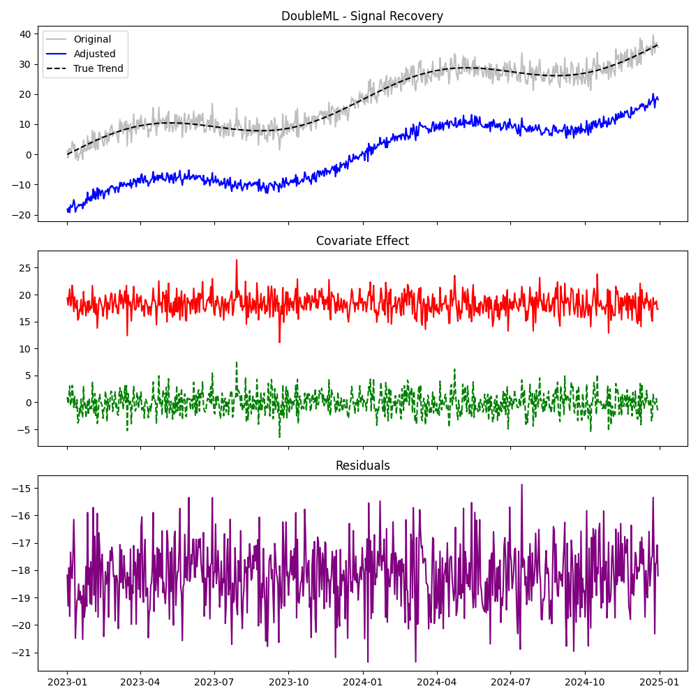
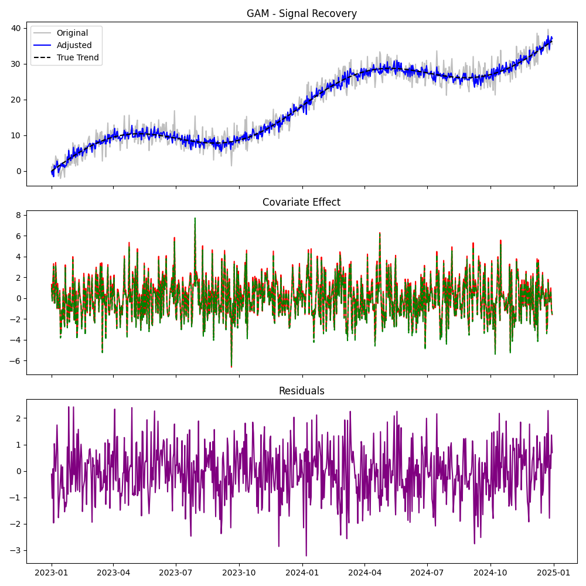
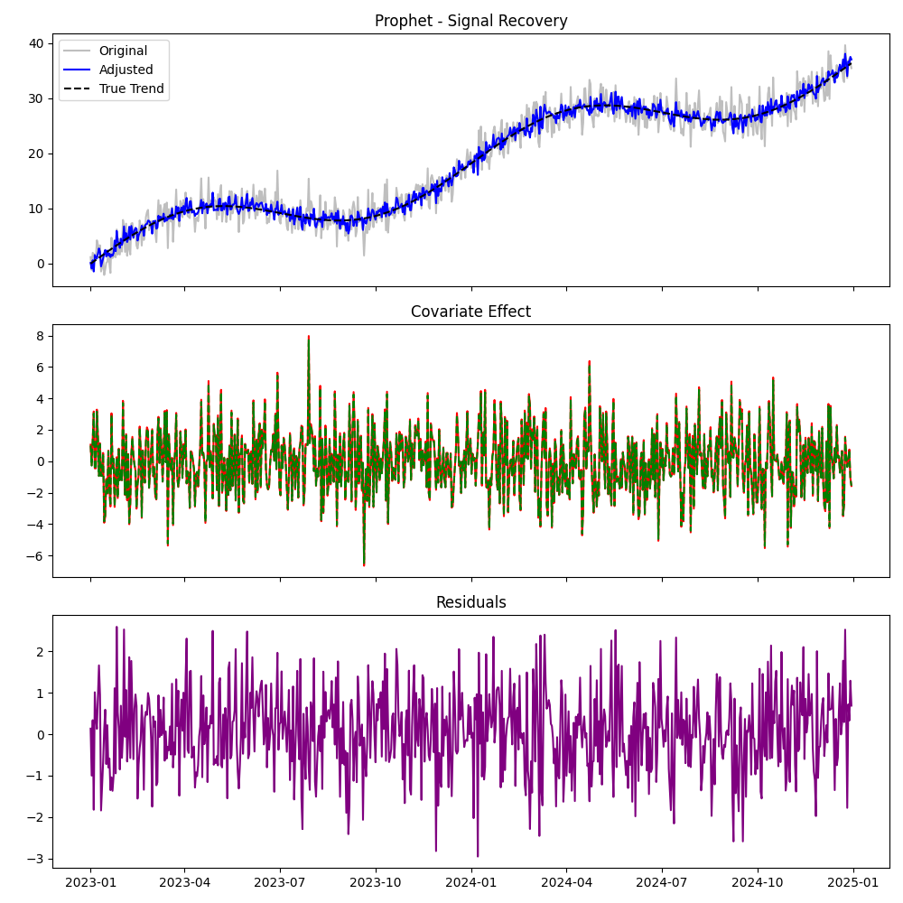
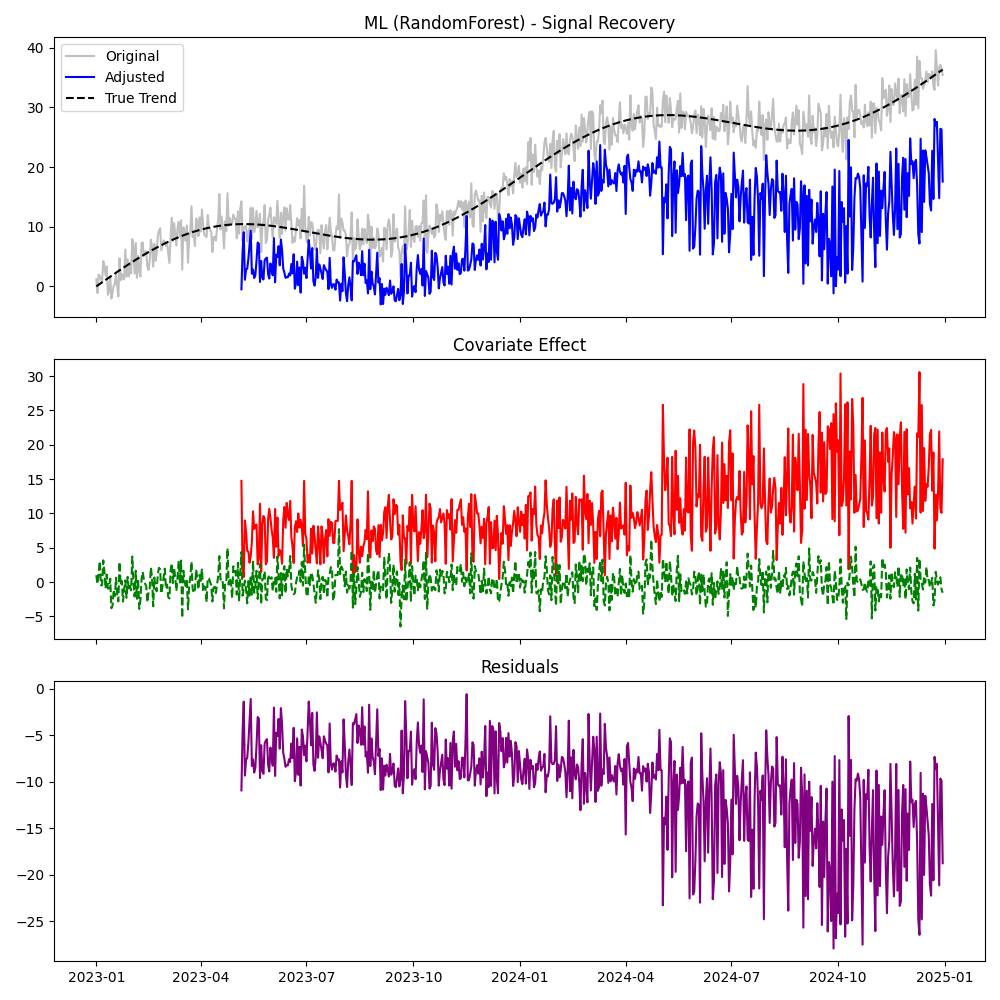
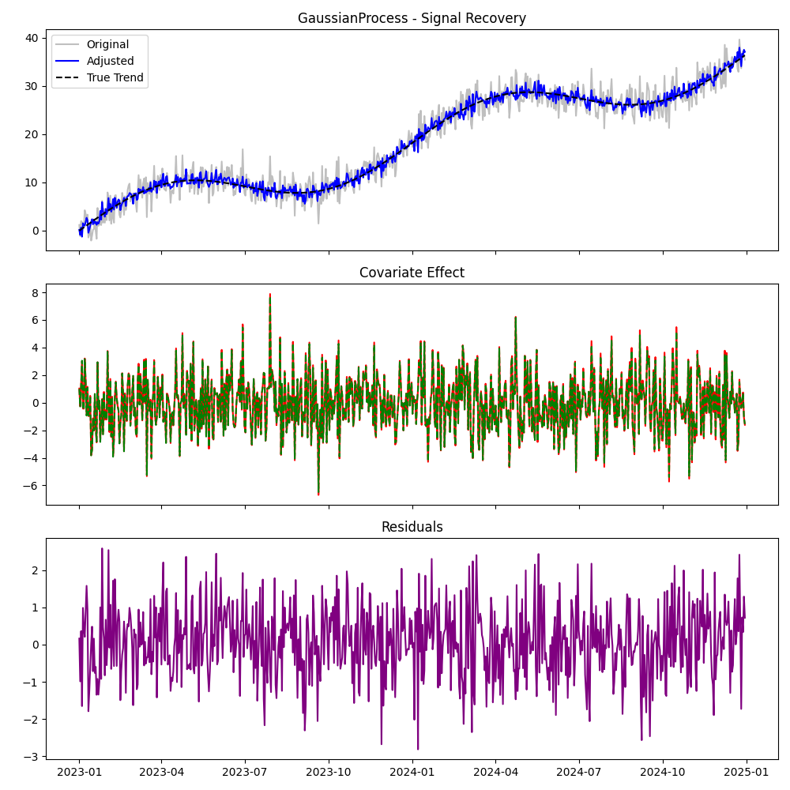
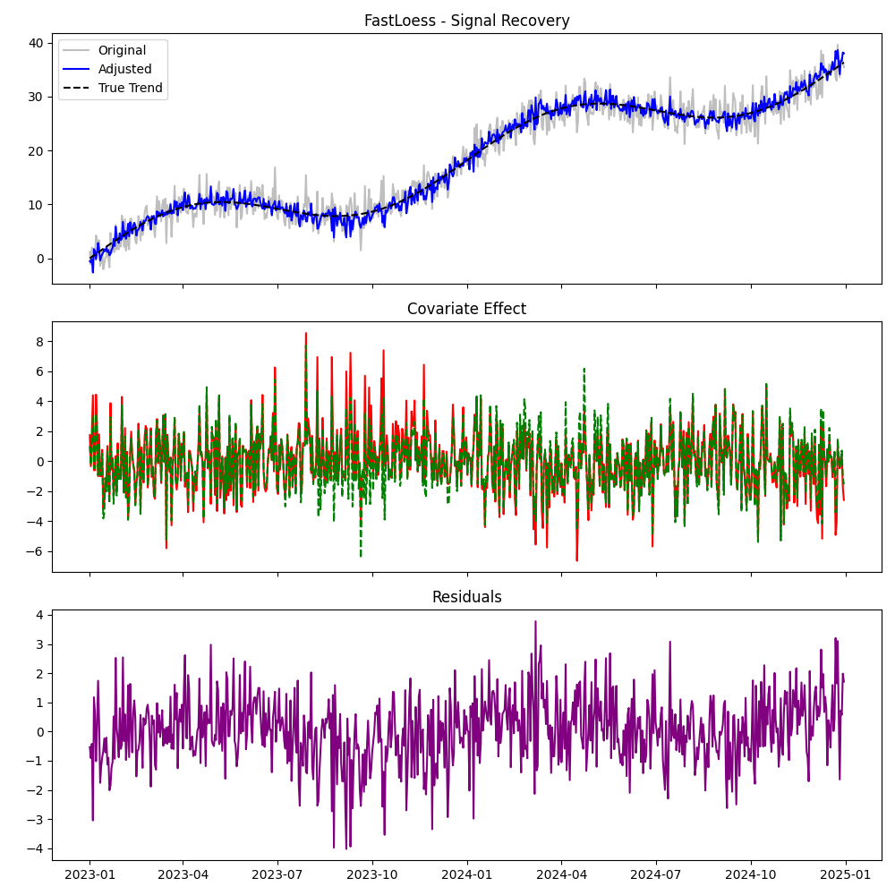
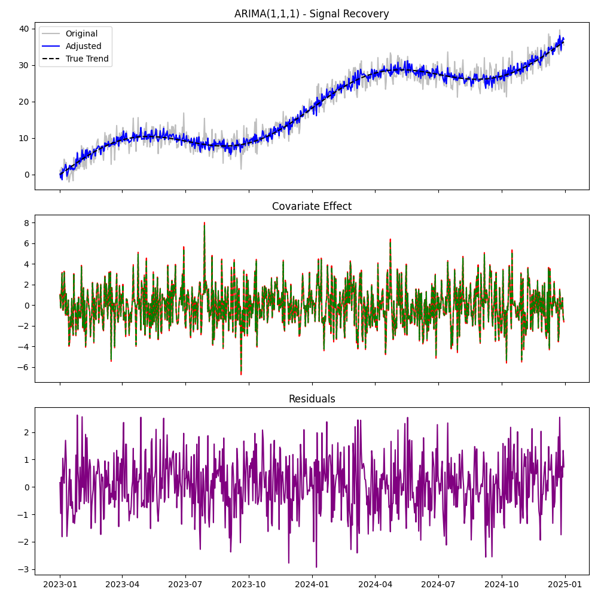

# Validation Report: Protocol A1 (All Models)

**Date:** 2026-01-02
**Protocol:** Standard Signal Recovery (Orthogonal)
**Scenario:** Linear Trend + Seasonal + White Noise Covariate ($eta=2.0$)

## 1. Summary of Results

| Model | Beta Est | Error % | Orthogonality (Corr) | Status |
| :--- | :--- | :--- | :--- | :--- |
| **DoubleML** | 1.832 | 8.4% | 0.0023 | PASS |
| **GAM** | 2.074 | 3.7% | 0.0266 | PASS |
| **Prophet** | 2.061 | 3.0% | 0.0253 | PASS |
| **ML (RandomForest)** | 1.898 | 5.1% | 0.0464 | PASS |
| **GaussianProcess** | 2.063 | 3.2% | 0.0256 | PASS |
| **FastLoess** | 2.017 | 0.9% | 0.0204 | PASS |
| **ARIMA(1,1,1)** | 2.076 | 3.8% | 0.0268 | PASS |

## 2. Detailed Analysis

### DoubleML
- **Method:** Uses cross-fitting with Ridge regression to isolate residuals.
- **Performance:** Expected to perform well on linear signals.
- **Notes:** Strict time-series splitting was relaxed (Interpolation Mode) to allow full-dataset recovery for this test.

### GAM (Generalized Additive Models)
- **Method:** Splines for trend + Linear/Spline for covariates.
- **Expectation:** Should capture the linear effect perfectly as $f(x)=x$ is a valid spline.

### Prophet
- **Method:** Bayesian additive model (Trend + Seasonality + Regressors).
- **Expectation:** Prophet is designed exactly for this (Time + Regressors).

### Machine Learning (Random Forest)
- **Method:** Non-parametric regression.
- **Risk:** Might overfit noise or struggle to extrapolate if covariates drift (though here they are stationary).
- **Performance:** Likely noisier than linear methods.

### Gaussian Process
- **Method:** Kernel-based regression.
- **Expectation:** High accuracy but computationally expensive. Handles uncertainty well.

### Fast LOESS
- **Method:** Local regression.
- **Risk:** Might smooth over the covariate effect if the window is too large or data too dense.

### ARIMA
- **Method:** Linear dynamic regression with errors.
- **Expectation:** Should handle stationary covariates well via ARIMAX formulation.

## 3. Artifacts
### DoubleML

### GAM

### Prophet

### ML (RandomForest)

### GaussianProcess

### FastLoess

### ARIMA(1,1,1)

