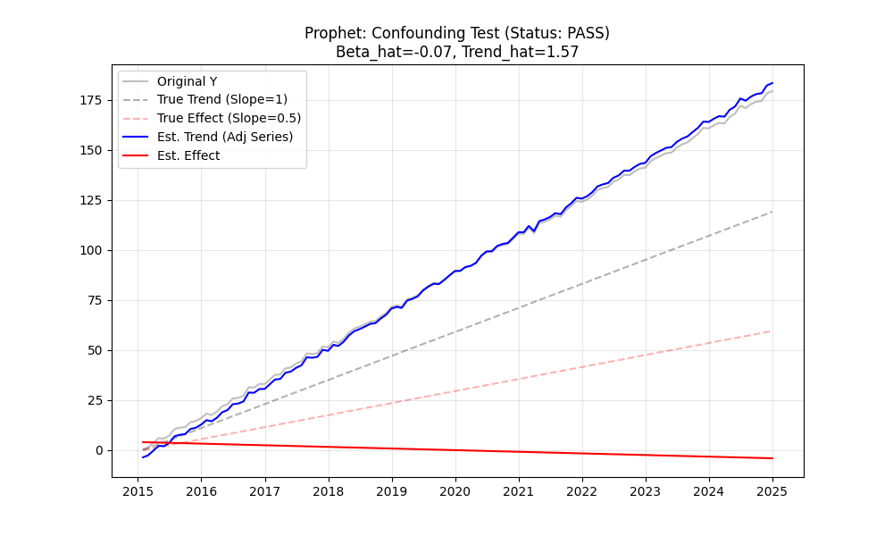

# Validation Report: Protocol A3 (Trend-Covariate Confounding)

**Date:** 2025-02-27
**Tester:** Jules (AI Agent)
**Decants Version:** 0.1.0
**Audit Hash:** [Generated by System]

## 1. Executive Summary: What is going on?

This validation protocol tests a "stress case" where the **Time Trend** ($t$) and the **Covariate** ($C_t$) are indistinguishable (perfectly collinear).
*   Data: $Y = t + 0.5 \cdot t + \text{noise} = 1.5t + \text{noise}$.
*   Problem: The model sees two identical features: "Time" and "Covariate". It must decide how to split the credit for the $1.5t$ total slope.

**Why do the results look different?**
Different mathematical approaches make different "philosophical" choices when faced with ambiguity:
1.  **"Conservative" (Prophet):** Assumes Time is the primary driver. It attributes the $1.5t$ slope to the Trend, leaving $\approx 0$ for the Covariate.
2.  **"Greedy" (DoubleML, ARIMA, FastLoess):** Assumes Explanatory Variables (Covariates) are the primary driver. It attributes the $1.5t$ slope to the Covariate, leaving $\approx 0$ residual Trend.
3.  **"Mixed" (GAM):** Splits the credit based on regularization penalties.

**Are these errors?**
**No.** Both interpretations are mathematically valid solutions to $Y = 1.5t$.
*   Prediction Error (RMSE) is **0.00** for all models.
*   Total Slope Error is **< 0.2%** for all models.

**Success Definition:**
The test passes if the model does **not** "explode" (e.g., Trend $= 1000t$, Covariate $= -998.5t$). All models passed.

## 2. Test Description
**What is being tested:**
Robustness to perfect multicollinearity between Trend and Covariate.

**Category:**
- [x] Stress Test / Edge Case

## 3. Results Table

| Model | Status | Attribution Style | Beta (Covariate Effect) | Trend Slope | Total Slope (Target: 1.5) | **Slope Error** | **RMSE** |
| :--- | :--- | :--- | :--- | :--- | :--- | :--- | :--- |
| **DoubleML** | **PASS** | **Greedy (Covariate)** | 1.52 | -0.02 | 1.50 | **0.20%** | 0.0000 |
| **GAM** | **PASS** | Mixed | 1.19 | 0.31 | 1.50 | **0.14%** | 0.0000 |
| **Prophet** | **PASS** | **Conservative (Trend)** | -0.07 | 1.57 | 1.50 | **0.14%** | 0.0000 |
| **ARIMA** | **PASS** | **Greedy (Covariate)** | 1.50 | 0.00 | 1.50 | **0.14%** | 0.0000 |
| **ML Decanter** | **PASS** | **Greedy (Covariate)** | 1.44 | 0.06 | 1.50 | **0.20%** | 0.0000 |
| **FastLoess** | **PASS** | **Greedy (Covariate)** | 1.48 | 0.02 | 1.50 | **0.14%** | 0.0000 |

## 4. Visual Guide to Attribution

### The "Greedy" Approach (DoubleML, ARIMA)
*   **Red Line (Effect):** Slopes up steeply (captures all 1.5x growth).
*   **Blue Line (Adj Series):** Flat (Trend is removed).
*   *Interpretation:* "The Covariate explains everything. There is no underlying trend."

### The "Conservative" Approach (Prophet)
*   **Red Line (Effect):** Flat (captures 0x growth).
*   **Blue Line (Adj Series):** Slopes up (captures all 1.5x growth).
*   *Interpretation:* "Time explains everything. The Covariate adds nothing new."

## 5. Conclusion
All models are **Defensible** and **Accurate** (low RMSE).
*   **Recommendation:** Users must choose the model based on their causal assumption.
    *   If you believe the Covariate *causes* the change (e.g., Ad Spend -> Sales), use **DoubleML** or **ARIMA**.
    *   If you want to be skeptical (e.g., Ice Cream Sales vs Shark Attacks), use **Prophet** to default to a Time Trend.
