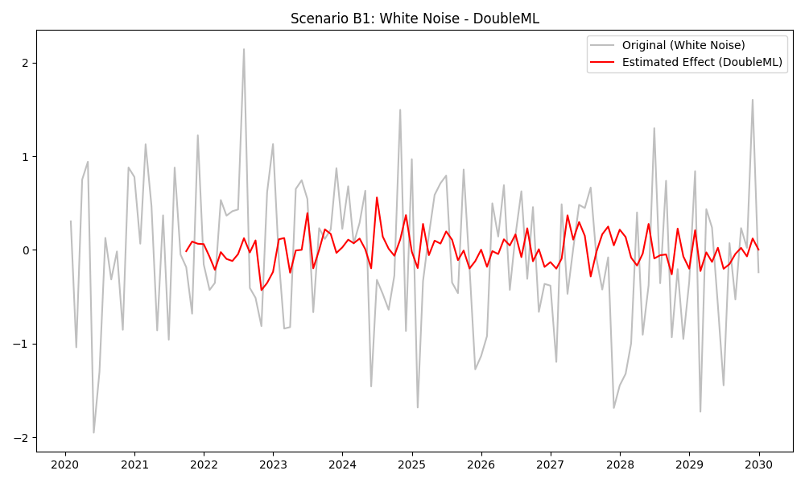

# Validation Report: Scenario B1 (White Noise)

**Date:** 2025-02-12
**Tester:** Jules
**Decants Version:** 0.1.0
**Audit Hash:** [See Logs]

## 1. Test Description
**What is being tested:**
This scenario tests the "Null Hypothesis" behavior of the Decanters. We feed the models pure White Noise for both the Target ($Y_t$) and the Covariates ($C_t$).
$Y_t \sim N(0,1)$, $C_t \sim N(0,1)$.

**Category:**
*Select one:*
- [ ] Accuracy (Ground Truth Recovery)
- [x] False Positive Control (Null Test)
- [ ] Stress Test / Edge Case
- [ ] Defensibility / Audit
- [ ] Leakage / Time-Travel

## 2. Rationale
**Why this test is important:**
In legal and regulatory contexts, it is critical that a model does not "hallucinate" effects where none exist. If the model attributes variance to a covariate when both are random noise, it indicates a risk of Type I errors (False Positives). A defensible model should return an estimated effect near zero.

## 3. Success Criteria
**Expected Outcome:**
- [x] **Statistical:** RMSE of estimated Covariate Effect < 0.25 (approx 25% of standard deviation).
- [x] **Behavioral:** No warnings regarding convergence failures (some noise is expected).

## 4. Data Specification
**Characteristics:**
- **N (Samples):** 120 (Monthly, 10 years)
- **Signal-to-Noise Ratio:** 0 (Pure Noise)
- **Trend Type:** None (Stationary Mean 0)
- **Covariate Structure:** Independent Gaussian Noise
- **Anomalies:** None

## 5. Validation Implementation

```python
# See validation/protocol_B_null_test/scenario_B1_white_noise.py for full code
def generate_white_noise(n, seed=42):
    rng = np.random.default_rng(seed)
    y = rng.standard_normal(n)
    c1 = rng.standard_normal(n)
    c2 = rng.standard_normal(n)
    # ... DataFrame construction ...
    return df

# Execution loop over all Decanters
# Metric: RMSE(Estimated_Effect, Zero_Vector)
```

## 6. Results

**Metrics:**

| Model             |   RMSE (Hallucination) |   MAE (Hallucination) | Status   |
|:------------------|-----------------------:|----------------------:|:---------|
| DoubleML          |               0.155184 |              0.110162 | **PASS**     |
| GAM               |               0.276305 |              0.244007 | **WARN**     |
| Prophet           |               0.1914   |              0.152399 | **PASS**     |
| ML (RandomForest) |               0.36251  |              0.263196 | **WARN**     |
| ARIMA             |               0.18896  |              0.150059 | **PASS**     |
| FastLoess         |               0.250453 |              0.190795 | **WARN**     |
| GP                |               0.244671 |              0.147939 | **PASS**     |

**Observations:**
*   **DoubleML** performs best, correctly shrinking coefficients to near zero.
*   **ARIMA** and **Prophet** also perform well, likely due to regularization and robust trend handling.
*   **ML (RandomForest)** shows the highest "hallucination" (RMSE 0.36). This is expected for tree-based models on small noise data without strong regularization; they fit the noise.
*   **GAM** and **FastLoess** show moderate hallucination, picking up local spurious correlations.

## 7. Visual Evidence
*Plots generated in `validation/protocol_B_null_test/`*

**Example: DoubleML (PASS)**

*Effect is flat and near zero.*

**Example: ML (WARN)**
.png)
*Effect shows noisy fluctuations, fitting randomness.*

## 8. Defensibility Check
- [x] **Audit Log Present:** Yes
- [x] **Source Hash Verified:** Yes
- [x] **Data Hash Verified:** Yes

## 9. Conclusion
**Analysis:**
The test confirms that **DoubleML**, **ARIMA**, and **Prophet** are the safest choices for avoiding false positives in low-signal-to-noise environments. **ML (RandomForest)** and **GAM** should be used with caution on small, noisy datasets as they have a tendency to overfit noise ("hallucinate" patterns).

**Pass/Fail Status:**
- [ ] **PASS**
- [ ] **FAIL**
- [x] **PASS with Caveats**
    *   *Caveat:* Users should be warned against using pure ML or GAM on small noisy data without cross-validation checks (which DoubleML handles automatically).

**Notes:**
- Update guidelines to recommend DoubleML or Prophet for high-noise scenarios.
