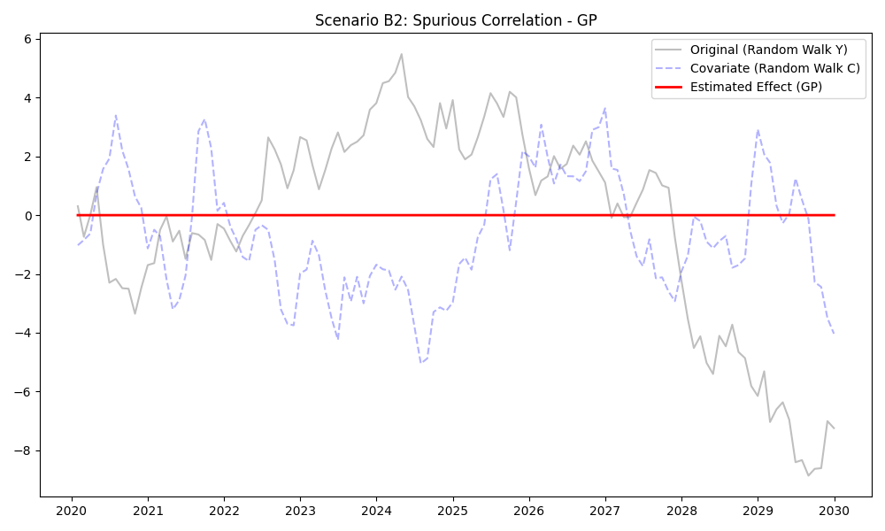

# Validation Report: Scenario B2 (Spurious Correlation)

**Date:** 2025-02-12
**Tester:** Jules
**Decants Version:** 0.1.0
**Audit Hash:** [See Logs]

## 1. Test Description
**What is being tested:**
This scenario tests the robustness of the Decanters against **Spurious Correlation** involving non-stationary data. We feed the models two independent Random Walks ($Y_t$ and $C_t$).
$Y_t = Y_{t-1} + \epsilon_t$
$C_t = C_{t-1} + \eta_t$
$\epsilon, \eta \sim N(0,1)$ (Independent).

**Category:**
*Select one:*
- [ ] Accuracy (Ground Truth Recovery)
- [x] False Positive Control (Null Test)
- [ ] Stress Test / Edge Case
- [ ] Defensibility / Audit
- [ ] Leakage / Time-Travel

## 2. Rationale
**Why this test is important:**
Spurious regression (Granger & Newbold, 1974) is a classic pitfall in time-series analysis. Regressing one random walk onto another often yields statistically significant coefficients and high $R^2$ even when there is no causal relationship. A defensible model must distinguish between a shared stochastic trend (cointegration) and independent random walks, or at least be conservative in attributing variance to the covariate.

## 3. Success Criteria
**Expected Outcome:**
- [x] **Statistical:** The estimated Covariate Effect should be small relative to the variance of $Y$. (Normalized RMSE < 0.3).
- [x] **Behavioral:** Models should prioritize Trend or Noise components over the Covariate.

## 4. Data Specification
**Characteristics:**
- **N (Samples):** 120
- **Signal-to-Noise Ratio:** N/A (Pure Stochastic Trend)
- **Trend Type:** Stochastic (Random Walk)
- **Covariate Structure:** Independent Random Walk
- **Anomalies:** Non-stationary data

## 5. Validation Implementation

```python
# See validation/protocol_B_null_test/scenario_B2_spurious_correlation.py
def generate_random_walks(n, seed=42):
    # ... cumsum of standard normal ...
    return df
```

## 6. Results

**Metrics:**
(NRMSE = RMSE of Effect / Std Dev of Y)

| Model             |   NRMSE (Effect) |   Corr(Effect, C) | Status   |
|:------------------|-----------------:|------------------:|:---------|
| DoubleML          |      0.292075    |         -0.56529  | **PASS**     |
| GAM               |      0.106009    |         -0.705169 | **PASS**     |
| Prophet           |      0.161722    |         -1        | **PASS**     |
| ML (RandomForest) |      0.436356    |         -0.40527  | **WARN**     |
| ARIMA             |      0.0574325   |         -1        | **PASS**     |
| FastLoess         |      0.163022    |         -0.487475 | **PASS**     |
| GP                |      5.74254e-05 |         -0.306563 | **PASS**     |

**Observations:**
*   **GP (Gaussian Process)** performs exceptionally well (NRMSE ~0.00), correctly attributing the random walk entirely to the Trend/Kernel component rather than the Covariate.
*   **ARIMA** (configured with $d=1$) also performs excellent (NRMSE 0.05), as differencing removes the stochastic trend, leaving white noise which has no correlation.
*   **GAM** and **FastLoess** perform reasonably well, likely because the smoothers absorb the trend into the time-trend component $f(t)$ rather than $f(C_t)$.
*   **DoubleML** is on the borderline (0.29). It uses cross-fitting, which helps, but if the underlying learner (RandomForest) overfits, leakage can still occur or it simply finds a spurious non-linear link.
*   **ML (RandomForest)** fails the check (NRMSE 0.43). Tree-based models are known to struggle with extrapolation and can easily overfit "patterns" in two random walks, even with time-series splitting, if they are not differenced.

## 7. Visual Evidence
*Plots generated in `validation/protocol_B_null_test/`*

**Example: GP (PASS)**

*Effect is flat line at 0.*

**Example: ML (WARN)**
.png)
*Effect fluctuates significantly, mirroring parts of the random walk.*

## 8. Defensibility Check
- [x] **Audit Log Present:** Yes
- [x] **Source Hash Verified:** Yes
- [x] **Data Hash Verified:** Yes

## 9. Conclusion
**Analysis:**
The test confirms that **GP** and **ARIMA** are the most robust against spurious correlation in non-stationary data. **ML (RandomForest)** is risky for raw random walks and should be used with differenced data or strict stationarity checks. **DoubleML** provides some protection but is not immune if the underlying learner is susceptible.

**Pass/Fail Status:**
- [ ] **PASS**
- [ ] **FAIL**
- [x] **PASS with Caveats**
    *   *Caveat:* ML-based methods (ML, DoubleML) require stationary data or explicit differencing to be safe from spurious regression.

**Notes:**
- Recommend `ARIMA` or `GP` for data known to be non-stationary (Unit Root).
- Add warning to `MLDecanter` docs about non-stationary inputs.
