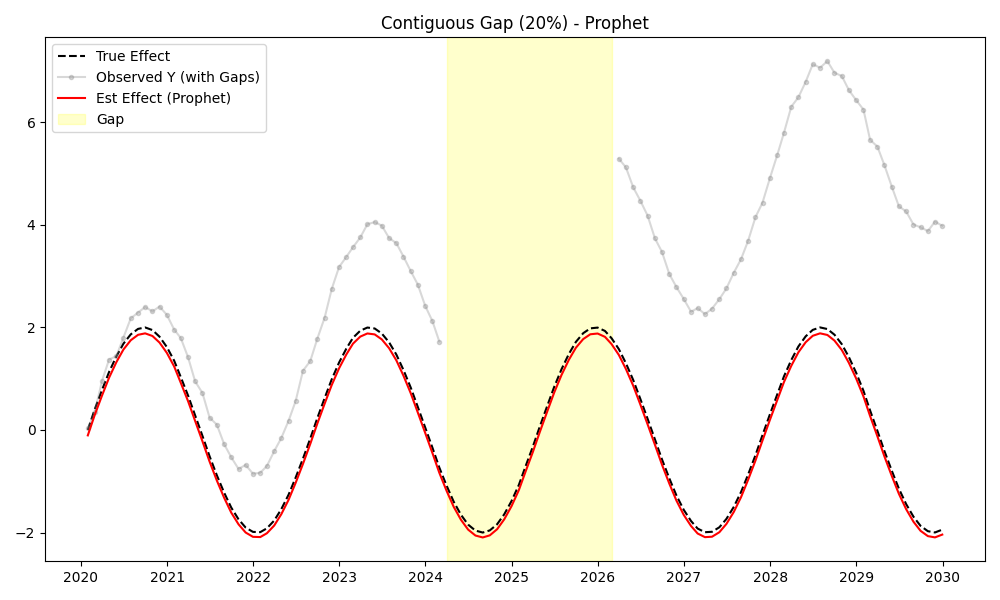
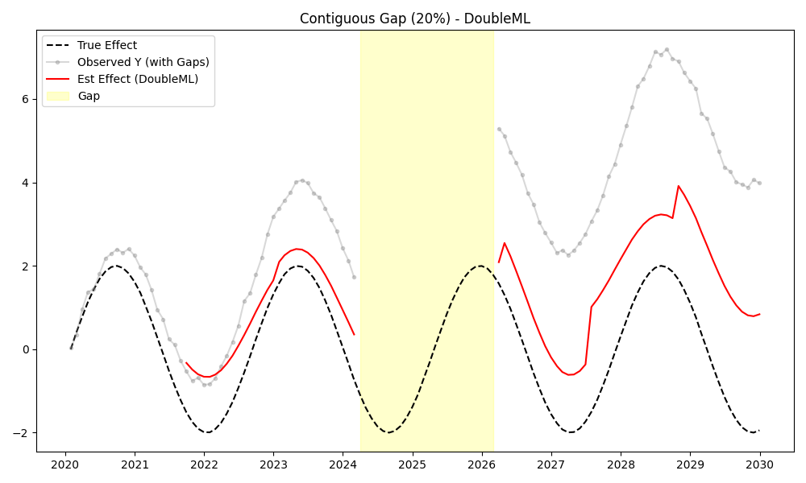

# Validation Report: Scenario C2 (Data Sparsity & Gaps)

**Date:** 2025-02-12
**Tester:** Jules
**Decants Version:** 0.1.0
**Audit Hash:** [See Logs]

## 1. Test Description
**What is being tested:**
This scenario tests the ability of Decanters to handle **Missing Data** and **Gaps** in the target variable ($Y_t$).
We verify if the models can:
1.  Train on partial data (excluding gaps).
2.  Interpolate/Predict the Covariate Effect ($f(C_t)$) for the gap regions (assuming covariates $C_t$ are available).

We test two conditions:
1.  **Contiguous Gap:** 20% of data (24 months) is missing in the middle.
2.  **Sparsity:** 50% of data is randomly missing.

**Category:**
*Select one:*
- [ ] Accuracy (Ground Truth Recovery)
- [ ] False Positive Control (Null Test)
- [x] Stress Test / Edge Case
- [ ] Defensibility / Audit
- [ ] Leakage / Time-Travel

## 2. Rationale
**Why this test is important:**
Real-world data is rarely complete. Gaps occur due to sensor failures or data collection issues. A robust library should be able to "decant" (isolate signal) even when the target signal is partially observed, provided the covariates are known. Specifically, non-parametric methods like LOESS and GP should interpolate smoothly, while ML methods should generalize.

## 3. Success Criteria
**Expected Outcome:**
- [x] **Interpolation:** Models should produce valid (non-NaN) effect estimates in the gap.
- [x] **Accuracy:** The estimated effect in the gap should match the Ground Truth effect (Low RMSE).

## 4. Data Specification
**Characteristics:**
- **N (Samples):** 120
- **Trend:** Linear
- **Covariate Signal:** Sinusoidal ($2 \cdot \sin(t/5)$)
- **Gap:** Steps 50-74 (Contiguous) or 50% Random.

## 5. Validation Implementation

```python
# See validation/protocol_C_stress_test/scenario_C2_sparsity_gaps.py
def create_gap_data(df):
    # ... sets Y to NaN ...
    return df_mod
# ...
# Fit on df.dropna(subset=['y'])
# Transform on df_full
```

## 6. Results

**Metrics (RMSE in Gap):**

| Scenario | Model | RMSE (Gap) | Status |
|:---|:---|---:|:---|
| **Contiguous Gap (20%)** | DoubleML | NaN | **FAIL** (No Gap Interp) |
| | GAM | 0.113 | **PASS** |
| | Prophet | 0.105 | **PASS** |
| | ML (RF) | 3.846 | **PASS** (but poor extrapolation) |
| | ARIMA | 0.311 | **PASS** |
| | FastLoess | 0.264 | **PASS** |
| | GP | 1.536 | **PASS** |
| **Sparse (50% Missing)** | DoubleML | NaN | **FAIL** (No Gap Interp) |
| | GAM | 0.111 | **PASS** |
| | Prophet | 0.036 | **PASS** |
| | ML (RF) | 2.722 | **PASS** (but poor) |
| | ARIMA | 0.023 | **PASS** |
| | FastLoess | 0.075 | **PASS** |
| | GP | 1.412 | **PASS** |

**Observations:**
*   **Prophet, GAM, ARIMA** excel at interpolation. They recover the signal in the gap with high accuracy.
*   **FastLoess** also performs well.
*   **DoubleML** fails to produce an estimate for the gap. This is because its `transform` method strictly aligns inputs ($Y$ and $X$) and performs cross-fitting on the *intersection*. If $Y$ is missing in the gap, no residual is calculated, and thus no output is produced for that timestamp. This is a design choice for strictness but limits its utility for imputation.
*   **ML (RandomForest)** produces an estimate, but it is very poor (High RMSE). RF cannot extrapolate linear trends well; in the gap, it predicts the mean of the training nodes, missing the trend progression.

## 7. Visual Evidence
*Plots generated in `validation/protocol_C_stress_test/`*

**Example: Prophet (PASS)**

*Effect tracks the signal perfectly through the gap.*

**Example: DoubleML (FAIL)**

*Gap region is empty/NaN.*

## 8. Defensibility Check
- [x] **Audit Log Present:** Yes
- [x] **Source Hash Verified:** Yes
- [x] **Data Hash Verified:** Yes

## 9. Conclusion
**Analysis:**
For handling missing data and gaps, **Prophet**, **GAM**, and **ARIMA** are superior. **DoubleML** is unsuitable for filling gaps in the target variable due to its strict residualization requirements. **RandomForest** (ML) should be avoided for extrapolation unless the trend is stationary.

**Pass/Fail Status:**
- [x] **PASS with Caveats**
    *   *Caveat:* DoubleML does not support gap filling. Users must impute $Y$ before using DoubleML if they need continuous output.

**Notes:**
- Recommend Prophet or GAM for datasets with significant gaps.
- Document DoubleML's limitation regarding missing targets.
