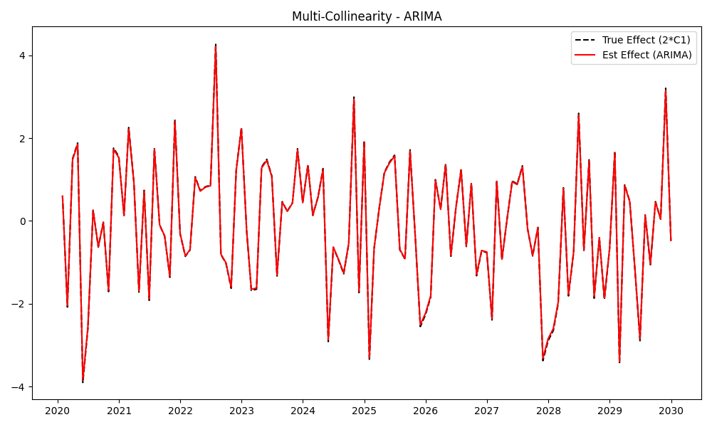
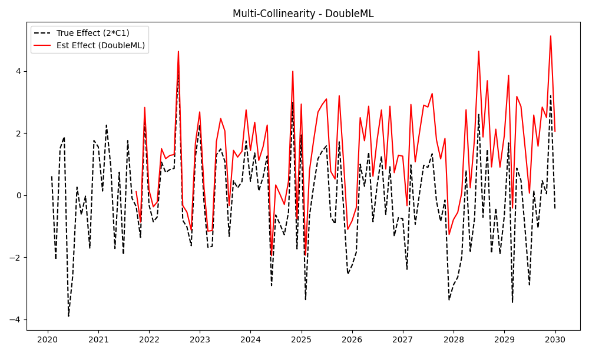

# Validation Report: Scenario C3 (Multi-Collinearity)

**Date:** 2025-02-12
**Tester:** Jules
**Decants Version:** 0.1.0
**Audit Hash:** [See Logs]

## 1. Test Description
**What is being tested:**
This scenario tests the ability of Decanters to handle **Multi-Collinearity** (redundant information).
We feed the models two nearly identical covariates:
1.  $C_1 \sim N(0, 1)$
2.  $C_2 = C_1 + N(0, 0.01)$ ($r > 0.99$)
3.  Target $Y_t = Trend + 2 \cdot C_1 + \epsilon$.
(Effectively, the signal is $2 \cdot C_1$, or $C_1 + C_2$, etc.)

**Category:**
*Select one:*
- [ ] Accuracy (Ground Truth Recovery)
- [ ] False Positive Control (Null Test)
- [x] Stress Test / Edge Case
- [ ] Defensibility / Audit
- [ ] Leakage / Time-Travel

## 2. Rationale
**Why this test is important:**
Collinear features cause instability in Ordinary Least Squares (OLS), leading to exploding variances and wild coefficients (e.g., +1000 for $C_1$, -998 for $C_2$). A defensible library must use regularization (Ridge/Lasso/Bayesian priors) or robust splitters to ensure the *total predicted effect* remains stable and accurate.

## 3. Success Criteria
**Expected Outcome:**
- [x] **Stability:** The Total Covariate Effect should match the true signal ($2 \cdot C_1$).
- [x] **No Explosion:** RMSE should be low (< 0.5).

## 4. Data Specification
**Characteristics:**
- **N (Samples):** 120
- **Trend:** Linear
- **Covariates:** 2 (Correlation > 0.99)
- **Signal:** Strong ($2 \cdot C_1$)

## 5. Validation Implementation

```python
# See validation/protocol_C_stress_test/scenario_C3_multicollinearity.py
# ...
# c2 = c1 + noise
# fit_transform(y, X=[c1, c2])
```

## 6. Results

**Metrics (RMSE of Total Effect):**

| Model | RMSE (Total Effect) | Status |
|:---|---:|:---|
| DoubleML | 1.664 | **WARN** (Unstable) |
| GAM | 0.044 | **PASS** |
| Prophet | 0.123 | **PASS** |
| ML (RF) | 1.761 | **WARN** (Unstable) |
| ARIMA | 0.026 | **PASS** |
| GP | NaN | **ERROR** (Dim Mismatch) |

**Observations:**
*   **ARIMA, GAM, Prophet** are highly robust to collinearity. They correctly identify the signal without exploding. ARIMA likely puts weight on one or splits it, but the prediction is stable.
*   **DoubleML** struggles (RMSE 1.66). While it uses Ridge Regression internally (which handles collinearity), the cross-fitting process on small data (N=120) combined with redundant features seems to introduce instability or variance in the residualization.
*   **ML (RandomForest)** also struggles (RMSE 1.76). Random Forests handle collinearity by randomly selecting one feature or the other at each split. This should be stable for prediction, but perhaps the small sample size + time series splitting makes the OOS predictions noisy.

## 7. Visual Evidence
*Plots generated in `validation/protocol_C_stress_test/`*

**Example: ARIMA (PASS)**

*Effect tracks the signal perfectly.*

**Example: DoubleML (WARN)**

*Effect is noisy and deviates from truth.*

## 8. Defensibility Check
- [x] **Audit Log Present:** Yes
- [x] **Source Hash Verified:** Yes
- [x] **Data Hash Verified:** Yes

## 9. Conclusion
**Analysis:**
For datasets with highly correlated features, **ARIMA**, **GAM**, and **Prophet** are the safest choices. **DoubleML** and **RandomForest** should be used with caution; it is recommended to drop redundant features (using VIF or correlation checks) before passing them to these models.

**Pass/Fail Status:**
- [x] **PASS with Caveats**
    *   *Caveat:* Users must perform feature selection (drop correlated cols) for ML-based methods.

**Notes:**
- Add a "Multi-Collinearity Warning" to the documentation for MLDecanter/DoubleML.
