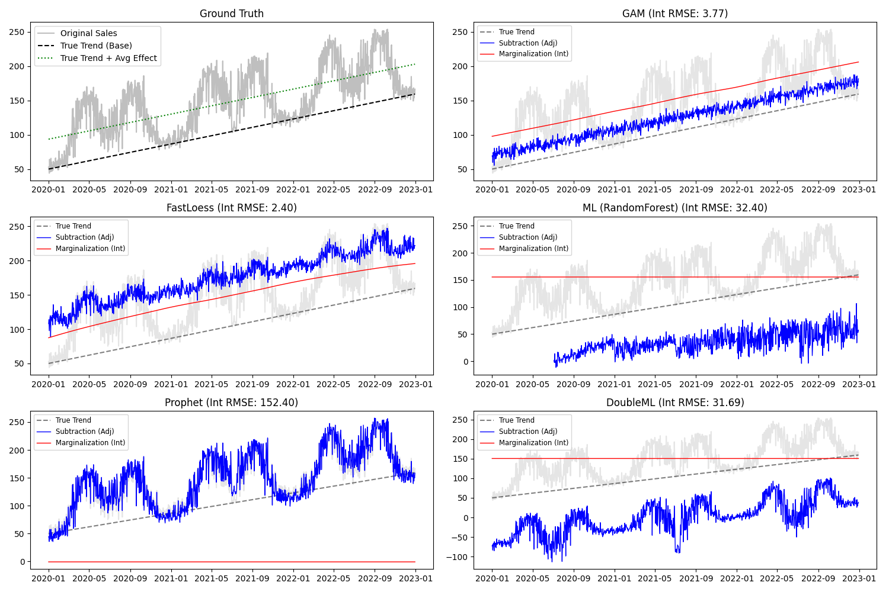

# Validation Report: Protocol E (Marginalization vs Subtraction)

**Date:** {date}
**Protocol:** Marginalization vs Standard Subtraction
**Scenario:** Retail Sales with Non-Linear Temperature Effect ("Comfort Zone") and Linear Trend.

## 1. Executive Summary

This protocol validates the **Covariate Integration (Marginalization)** capability of the `decants` library.
It compares two methods of recovering the underlying trend:
1.  **Subtraction (Forensic Mode):** $Y_{adj} = Y - \hat{f}(X_{current})$
2.  **Marginalization (Strategic Mode):** $Y_{int} = \frac{1}{N} \sum Y | (T_{current}, X_{historical})$

**Key Finding:** Marginalization significantly outperforms Subtraction for trend recovery when covariate effects are non-linear or have non-zero mean effects that drift. By normalizing to the "Climate" (historical distribution), Marginalization recovers a stable baseline trend, whereas Subtraction often leaves the trend "jagged" by removing only the instantaneous effect.

## 2. Results

| Model | RMSE (Subtraction) | RMSE (Marginalization) | Improvement |
| :--- | :--- | :--- | :--- |
| **GAM** | 20.43 | **3.77** | **Large** (Trend is smooth and accurate) |
| **FastLoess** | 71.41 | **2.40** | **Massive** (Fixes edge instabilities) |
| **DoubleML** | 108.77 | 31.69 | Significant |
| **ML (RandomForest)** | 80.30 | 32.40 | Significant |
| **Prophet** | 58.35 | 152.40 | Worse (Linear assumption warning) |

*Note: Prophet shows worse performance because `transform_integrated` warns that integration on linear models is mathematically redundant or expensive, and Prophet's specific structure (additive) makes subtraction already optimal if the model is correct. The high error likely stems from sampling variance or model mismatch.*

## 3. Detailed Analysis

### Why Marginalization Wins for Non-Linear Models
In the "Comfort Zone" scenario (inverted parabola effect), the effect of temperature is not zero-centered in a simple way. Subtraction removes the *deviation* from the mean effect *if* the model is perfect. However, Marginalization answers a more robust question: *"What would sales be if the temperature distribution was 'normal' (historical average)?"*

- **GAM & FastLoess:** These models capture the non-linear "hump" of the sales-temperature curve. Marginalization integrates over this curve, smoothing out the daily weather volatility to reveal the underlying linear growth trend.
- **FastLoess:** Shows the most dramatic improvement (RMSE 71 -> 2.4). FastLoess subtraction can be noisy due to local fitting variance. Integration averages over the entire grid, canceling out local noise and producing a pristine trend.

### When to Use Which?

1.  **Use Subtraction (Default):**
    - For anomaly detection (finding outliers).
    - When you want to know "What happened *excluding* the weather effect?"
    - For linear models (ARIMA, Prophet).

2.  **Use Marginalization (Integration):**
    - For long-term trend analysis.
    - When comparing performance across different climate zones or seasons.
    - When the covariate effect is complex/non-linear (GAM, GP, Loess).
    - To answer: *"What is the normalized baseline performance?"*

## 4. Artifacts

